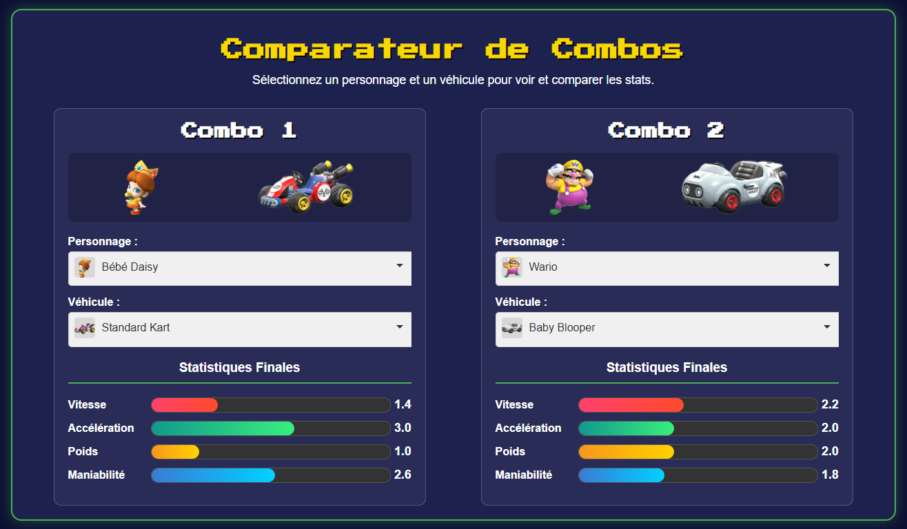

# Comparateur de Combos Mario Kart



Bienvenue sur le Comparateur de Combos Mario Kart ! Cette application web vous permet de sélectionner et de comparer côte à côte deux combinaisons de personnage et de véhicule pour analyser leurs statistiques finales. C'est l'outil parfait pour trouver le combo idéal pour votre style de jeu.

---

### 🚀 Démo en direct

Vous pouvez tester l'application en direct ici : 
**[Lien vers la démo](https://DZTic.github.io/Builder-Mario-Kart-World/)**

---

### ✨ Fonctionnalités

-   **Comparaison Double :** Comparez deux combos (personnage + véhicule) simultanément.
-   **Calculs Dynamiques :** Les statistiques (Vitesse, Accélération, Poids, Maniabilité) sont mises à jour en temps réel à chaque sélection.
-   **Visualisation des Stats :** Des barres de progression colorées permettent de visualiser rapidement les points forts de chaque combo.
-   **Interface Visuelle :** Affiche les images des personnages et des véhicules pour une meilleure reconnaissance.
-   **Listes Déroulantes Avancées :** Grâce à **Choices.js**, les listes sont interactives, consultables et affichent les images à côté des noms.
-   **Données Fiables :** Les statistiques et les formules de calcul sont basées sur le document communautaire "Mario Kart World stats and builder".
-   **Interface en Français :** L'ensemble de l'interface, y compris les noms des personnages, est en français.

---

### 🛠️ Technologies Utilisées

-   **HTML5 :** Pour la structure de la page.
-   **CSS3 :** Pour le style et le design, avec une utilisation de Flexbox pour la mise en page.
-   **JavaScript (ES6+) :** Pour toute la logique de l'application, les calculs et la manipulation du DOM.
-   **[Choices.js](https://github.com/Choices-js/Choices) :** Une bibliothèque JavaScript pour créer des listes déroulantes personnalisées, consultables et stylisées.
-   **[Google Fonts](https://fonts.google.com/) :** Utilisation de la police "Press Start 2P" pour le look rétro arcade.

---

### 📂 Structure du Projet

Le projet est organisé comme suit :

```
/
├── images/
│   ├── drivers/
│   │   ├── mario.png
│   │   ├── bowser.png
│   │   └── ... (toutes les images des personnages)
│   ├── vehicles/
│   │   ├── standard-kart.png
│   │   ├── b-dasher.png
│   │   └── ... (toutes les images des véhicules)
│   └── placeholder.png
├── index.html         (Structure de la page)
├── script.js          (Logique de l'application et données)
├── style.css          (Feuille de style)
└── README.md          (Ce fichier)
```

---

### ⚙️ Installation et Utilisation Locale

1.  **Ouvrez le fichier `index.html`** dans votre navigateur web préféré. Et voilà !

---

### 📊 Source des Données

Les modificateurs de statistiques et les formules de calcul utilisées dans ce projet proviennent du Google Sheet communautaire **"Mario Kart World stats and builder"**. Tout le crédit pour la collecte de ces données revient à ses auteurs originaux.

---

### 📜 Licence

Ce projet est sous licence MIT. Voir le fichier `LICENSE` pour plus de détails.
